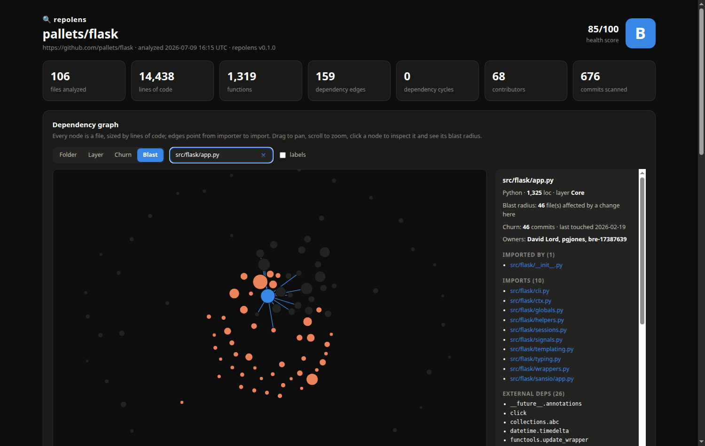
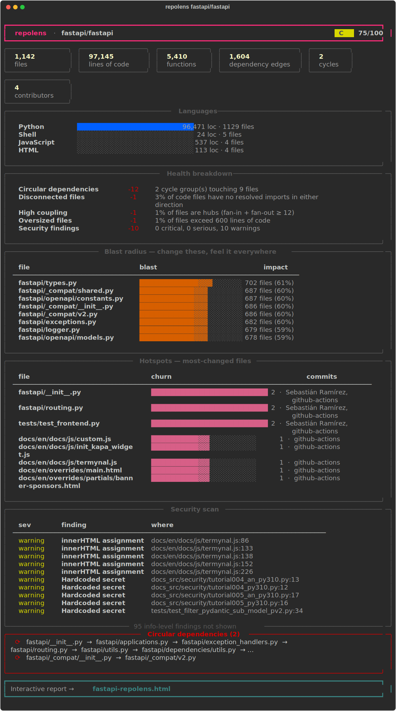
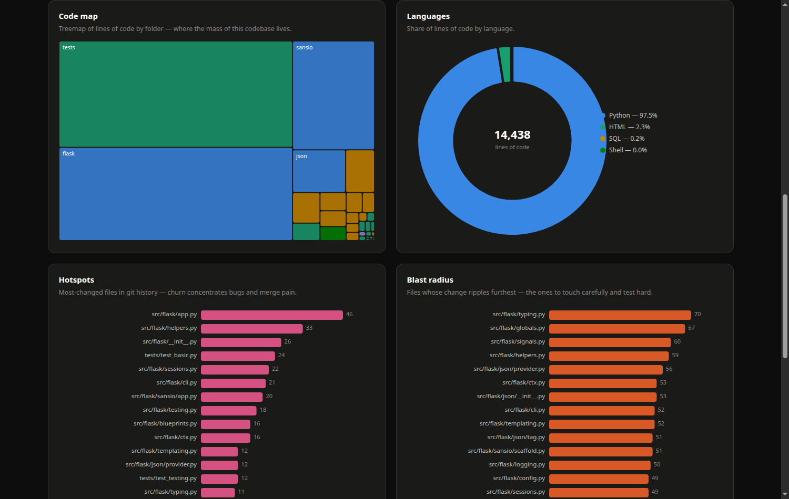

<div align="center">

# 🔍 repolens

### X-ray any codebase in one command

**One line in, one file out** — an interactive architecture map, blast-radius explorer,
health grade, security scan, and hotspot report for any repo, local or on GitHub.

[](https://pypi.org/project/repolens/)
[](https://pypi.org/project/repolens/)
[](LICENSE)
[](https://github.com/nguyenminhduc9988/repolens/actions)

```bash
uvx repolens facebook/react        # ← that's the whole setup
```



</div>

---

## One-liners

```bash
uvx repolens .                     # analyze the repo you're standing in (zero install)
uvx repolens pallets/flask         # analyze any GitHub repo by shorthand
uvx repolens https://github.com/fastapi/fastapi
pipx run repolens .                # same, via pipx
pip install repolens && repolens . # the classic way
```

Every run prints a rich terminal summary **and** writes a **single self-contained HTML file**
— D3 inlined, zero external requests, works offline, safe to email or attach to a PR.
Your code never leaves your machine.

<div align="center">

</div>

## What you get

| | |
|---|---|
| 🕸️ **Interactive dependency graph** | Force-directed map of every file. Four color modes — folder, architectural layer, churn, blast. Click any node for its imports, dependents, functions, and owners. |
| 💥 **Blast radius** | *"If I change this file, what breaks?"* Transitive-dependent analysis answers it per file, in the terminal and the graph. |
| 🏥 **Health grade (A–F)** | Cycles, coupling, oversized files, disconnected code, and security findings — with a transparent penalty breakdown, never a black-box number. |
| 🔐 **Security scan** | Committed private keys, AWS/GitHub/Slack tokens, hardcoded secrets, SQL built by string-glue, `eval`/`exec`, unsafe deserialization, disabled TLS verification. Findings in test/docs paths are automatically demoted. |
| 🔥 **Hotspots & ownership** | Per-file commit churn and top contributors mined from git history — know what's volatile and who to ask. |
| ⟳ **Circular dependencies** | Strongly-connected components across the import graph (Tarjan), with the actual file chains. |
| 🗺️ **Code map** | Treemap of lines-of-code by folder, language donut, largest-impact and most-changed bar charts. |
| 📤 **JSON export** | `--json` dumps the entire model — pipe it into CI gates, dashboards, or your own tooling. |



## How the analysis works

repolens parses source with per-language extraction (30+ languages: Python, TypeScript/JavaScript,
Go, Rust, Java, Kotlin, C/C++, C#, Ruby, PHP, Swift, Elixir, and more), then resolves imports to
files **inside the repo** to build a real dependency graph:

- Python: `from X import name` expands to submodules, `src/`-layout packages resolve,
  `if TYPE_CHECKING:` blocks and function-body (deferred) imports are excluded — so the
  cycles it reports are cycles that actually bite at import time.
- JS/TS: relative paths, `index.*` resolution, `require`/dynamic `import()`.
- Ambiguous names are settled by ranking (package roots beat stray same-named fixtures)
  instead of being dropped.

On top of the graph: blast radius (reverse-reachability per file), SCC cycle detection,
layer classification, hub/coupling metrics, and a security ruleset tuned for precision.
Everything is heuristic and fast — ~1 second for a 1,000-file repo — built for orientation,
not for replacing a compiler.

## Usage

```text
repolens [target] [options]

target                 local path, owner/repo, or GitHub URL (default: .)

-o, --output FILE      HTML report path (default: <name>-repolens.html)
    --json [FILE]      dump the full analysis model as JSON (stdout if no FILE)
-x, --exclude PATTERN  extra exclude glob, repeatable (e.g. -x 'docs/**')
    --max-files N      cap analyzed files (default: 6000)
    --no-open          don't auto-open the report in a browser
    --no-html          terminal summary only
-q, --quiet            no terminal summary
```

### As a library

```python
from repolens import analyze

report = analyze("path/or/owner/repo")
print(report["health"]["grade"], report["repo"]["edges"])
```

### In CI

```bash
pip install repolens
repolens . --no-open --no-html --json report.json
python -c "import json,sys; sys.exit(json.load(open('report.json'))['health']['score'] < 70)"
```

## Privacy

- Local analysis never touches the network.
- GitHub targets are shallow-cloned with your own `git` (and deleted afterward) — no tokens
  collected, no telemetry, nothing phoned home.
- The HTML report inlines D3, so opening it makes **zero** external requests.

## Credits

repolens is a from-scratch Python reimagining of
[**CodeFlow**](https://github.com/braedonsaunders/codeflow) by Braedon Saunders — a lovely
browser-only codebase visualizer. Same mission (*stop guessing, start seeing*), rebuilt as an
installable CLI with a resolvable import graph, honest health scoring, git mining, and
offline single-file reports.

## License

MIT — see [LICENSE](LICENSE).

<div align="center">

*Stop guessing. Start seeing.*

</div>
